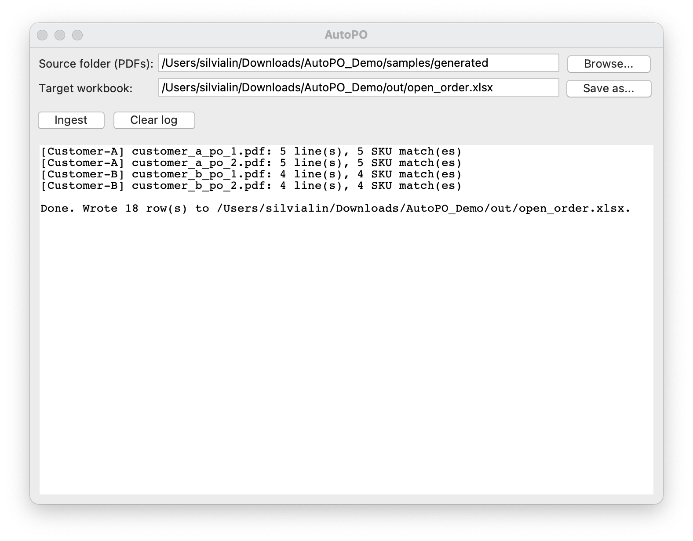
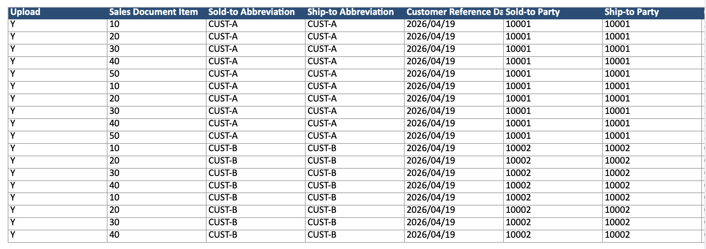

# AutoPO

Python pipeline that reads customer purchase order PDFs, extracts line items, reconciles them against an internal SKU table, and appends them to the operations team's shipment-tracking Excel workbook.

This system was originally built at a mid-sized electronics manufacturer to replace a manual copy-paste workflow that took ~90 minutes per day per region. The production version now handles 30+ customer PO formats across 5 regional workbooks and is used daily by 4 sales-operations teams in APAC, EU, US and JP.

This repository is a **sanitized public demo**. Customer names, part numbers, prices and ERP codes are all synthetic. Two representative parsers — _Customer-A_ and _Customer-B_ — stand in for the two archetypes of PO PDF encountered.

## Impact

| Metric                            | Before  | After  |
| :-------------------------------- | :------ | :----- |
| PO entry time per region, per day | ~90 min | ~3 min |
| Transcription errors per week     | 5–10    | ~0     |
| Customer formats supported        | manual  | 30+    |

## Quick start

**Requirements:** Python 3.10 or newer.

```bash
python3 --version   # must be 3.10+
```

### macOS / Linux

```bash
git clone https://github.com/silviaiaia/AutoPO_Demo.git
cd AutoPO_Demo

python3 -m venv .venv
source .venv/bin/activate

pip install --upgrade pip
pip install -e .

# generate synthetic PDFs, then ingest them
mkdir -p out
python samples/generate_mock_pos.py --out samples/generated
python -m autopo.cli ingest samples/generated/ --workbook out/open_order.xlsx
```

### Windows (PowerShell)

```powershell
git clone https://github.com/silviaiaia/AutoPO_Demo.git
cd AutoPO_Demo

py -3 -m venv .venv
.venv\Scripts\Activate.ps1

pip install --upgrade pip
pip install -e .

# generate synthetic PDFs, then ingest them
mkdir out
python samples\generate_mock_pos.py --out samples\generated
python -m autopo.cli ingest samples\generated\ --workbook out\open_order.xlsx
```

The result is written to `out/open_order.xlsx`.

### GUI

```bash
python -m autopo.gui
```

> On macOS, the Tkinter GUI needs Tk installed alongside Python.
> With Homebrew: `brew install python-tk`

## Tests

```bash
pip install -e ".[dev]"
pytest
```

## Screenshots

### GUI

<p align="center">
  
</p>

### Output Excel



## Architecture

```
    PO PDFs ──▶ Dispatcher ──▶ Customer parser ──┐
                                                 ▼
                              Normalizer + Mapper (dates, SKUs, aliases)
                                                 │
                                                 ▼
                                          Excel writer
```

```
src/autopo/
├── config.py                # canonical columns + synthetic customer registry
├── cli.py                   # `python -m autopo.cli ingest ...`
├── gui.py                   # Tkinter front-end
├── core/
│   ├── normalize.py         # dates, numbers, key canonicalization
│   ├── mapper.py            # customer-alias collapsing + SKU lookup
│   └── excel_writer.py      # openpyxl writer for the Open Order workbook
└── parsers/
    ├── base.py              # BaseParser + auto-registry
    ├── dispatch.py          # first-page fingerprint → parser
    ├── customer_a.py        # free-text layout
    └── customer_b.py        # tabular layout
```

New customers are added by dropping another `BaseParser` subclass into
`parsers/` — the dispatcher, mapper and writer need no changes.

## Tests

```bash
pytest
```

## License

[MIT](LICENSE).
